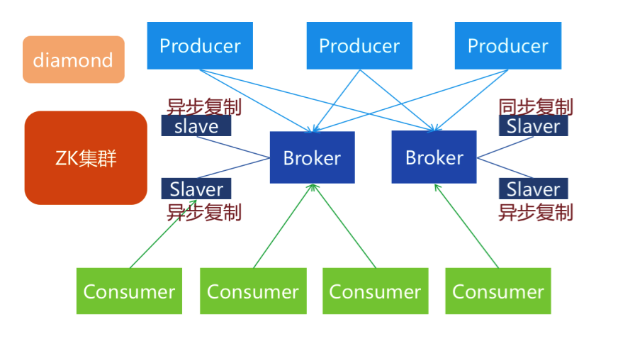
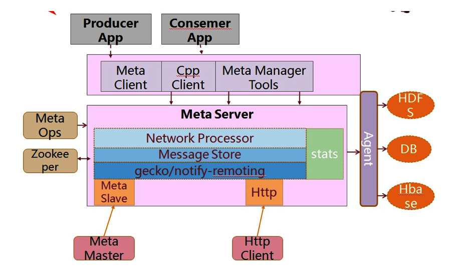
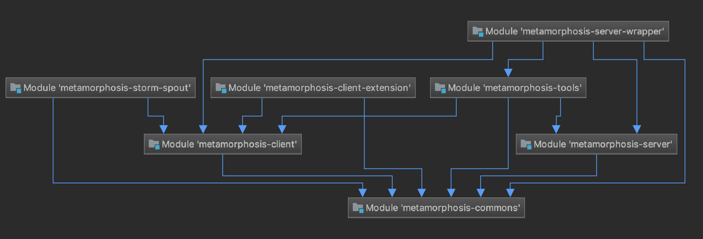

## Metamorphosis介绍
​	Metamorphosis是一个高性能、高可用、可扩展的分布式消息中间件，思路起源于LinkedIn的Kafka，但并不是Kafka的一个Copy。具有消息存储顺序写、吞吐量大和支持本地和XA事务等特性，适用于大吞吐量、顺序消息、广播和日志数据传输等场景，目前在淘宝和支付宝有着广泛的应用。

###特征
* 生产者、服务器和消费者都可分布
* 消息存储顺序写
* 性能极高,吞吐量大
* 支持消息顺序
* 支持本地和XA事务
* 客户端pull，随机读,利用sendfile系统调用，zero-copy ,批量拉数据
* 支持消费端事务
* 支持消息广播模式
* 支持异步发送消息
* 支持http协议
* 支持消息重试和recover
* 数据迁移、扩容对用户透明
* 消费状态保存在客户端
* 支持同步和异步复制两种HA
* 支持group commit
* 更多……


###概念和术语

- 消息，全称为Message，是指在生产者、服务端和消费者之间传输数据。
- 消息代理：全称为Message Broker，通俗来讲就是指该MQ的服务端或者说服务器。
- 消息生产者：全称为Message Producer，负责产生消息并发送消息到meta服务器。
- 消息消费者：全称为Message Consumer，负责消息的消费。
- 消息的主题：全称为Message Topic，由用户定义并在Broker上配置。producer发送消息到某个topic下，consumer从某个topic下消费消息。
- 主题的分区：也称为partition，可以把一个topic分为多个分区。每个分区是一个有序，不可变的，顺序递增的commit log。
- 消费者分组：全称为Consumer Group，由多个消费者组成，共同消费一个topic下的消息，每个消费者消费部分消息。这些消费者就组成一个分组，拥有同一个分组名称,通常也称为消费者集群
- 偏移量：全称为Offset，分区中的消息都有一个递增的id，我们称之为Offset，它唯一标识了分区中的消息。


### 架构示意


从上图可以看出，有4个集群。其中，Broker集群存在MASTER-SLAVE结构。

多台broker组成一个集群提供一些topic服务，生产者集群可以按照一定的路由规则往集群里某台broker的某个topic发送消息，消费者集群按照一定的路由规则拉取某台broker上的消息。

###总体结构



###内部结构


###源代码结构

* Client,生产者和消费者客户端
* Client-extension，扩展的客户端。用于将消费处理失败的消息存入notify(未提供),和使用meta作为log4j appender，可以透明地使用log4j API发送消息到meta。
* Commons，客户端和服务端一些公用的东西
* Example,客户端使用的例子
* http-client，使用http协议的客户端
* server，服务端工程
* server-wrapper，扩展的服务端，用于将其他插件集成到服务端，提供扩展功能
    1.Meta gergor，用于高可用的同步复制
    2.Meta slave，用于高可用的异步复制
    3.http，提供http协议支持
* Meta spout，用于将meta消息接入到twitter storm集群做实时分析
* Tools，提供服务端管理和操作的一些工具




## 客户端使用例子说明

metamorphosis-example里面有详细的使用例子，包括：

- 普通发送消息
- 异步发送消息
- 异步单向发送消息
- 本地事务发送消息
- XA事务发送消息
- Log4j发送，log4j appender配置在main/resources目录下
- 普通消费
- 广播消费
- 批量事务消费
- 同步拉取消费

客户端依赖：

```xml
<dependency>
    <groupId>com.taobao.metamorphosis</groupId>
    <artifactId>metamorphosis-client</artifactId>
    <version>1.4.0.taocode-SNAPSHOT</version>
</dependency>
<dependency>
    <groupId>com.taobao.metamorphosis</groupId>
    <artifactId>metamorphosis-client-extension</artifactId>
    <version>1.4.0.taocode-SNAPSHOT</version>
</dependency>
```

如果打包有错误请检查是否在自己的maven库发布过客户端了


## 配置参数说明

###1.MetaQ服务器端配置

​	MetaQ服务启动时，需要在JVM携带启动的配置参数，该配置参数用于指定MQ服务器的配置文件，例如：

* Linux：-f /Users/wanghongzhan/whz/ideaProject/Metamorphosis/metamorphosis-dashboard/dev/server.ini
* windows：-f D:\myMoveDisk\6_fromGit\Metamorphosis\metamorphosis-dashboard\dev\server.ini

配置文件内容例如：

```ini
[system]
brokerId=0
numPartitions=1
serverPort=8123
unflushThreshold=0
unflushInterval=10000
maxSegmentSize=1073741824
maxTransferSize=1048576
deletePolicy=delete,168
deleteWhen=0 0 6,18 * * ?
flushTxLogAtCommit=1
stat=true

;; Update consumers offsets to current max offsets when consumers offsets are out of range of current broker's messages.
;; It must be false in production.But recommend to be true in development or test.
updateConsumerOffsets=true

[zookeeper]
zk.zkConnect=localhost:2181
zk.zkSessionTimeoutMs=30000
zk.zkConnectionTimeoutMs=30000
zk.zkSyncTimeMs=5000

;; Topics section
[topic=test]
省略...
[topic=meta-test]
省略...
```

该server.ini对应的配置源码里的MetaConfig.java类，详细的配置项如下：

| 配置项                                           | 说明                                                         |
| ------------------------------------------------ | ------------------------------------------------------------ |
| brokerId                                         | 服务器集群中唯一的id，必须为整型0-1024之间，对服务器集群的定义是使用同一个zookeeper并且在zookeeper上的root path相同，具体参见zookeeper配置 |
| dataPath                                         | 表示消息存储在MQ服务器上的磁盘目录，默认为用户目录下的meta目录（System.getProperty("user.home") + File.separator + "meta"）<br />消息具体存储的目录 = dataPath + File.separator + topic + "-" + partition |
| serverPort                                       | MQ默认的端口，默认为：8123                                   |
| dashboardHttpPort                                | 控制板端口，默认为：8120                                     |
| hostName                                         | 表示MQ服务器所在的机器，如果没有配置，默认为本地IP地址       |
| numPartitions                                    | 表示MQ服务器中topic的可用分区数，默认为1，分区索引从0开始，该参数可以被topic的配置覆盖。每个topic在MQ服务器上可以有多个分区，当生产者向MQ服务器发送消息时，如果客户端没有指定分区（客户端没有指定分区时， 请求中的分区索引默认是-1），则服务器会从可用（分区是可以被关闭的）的分区中，随机选择一个分区来保存消息 |
| unflushThreshold（这个参数很重要，还要在研究下） | 表示每隔多少条消息做一次磁盘同步，默认为1000条，也就是说在掉电情况下，最多允许丢失1000条消息。 <br/>        消息生产者发送的消息，meta服务器收到后在做必要的校验和检查之后的第一件事就是写入磁盘，写入成功之后返回应答给生产者，生产者发送消息返回SendResult，如果isSuccess返回为true,则表示消息已经确认发送到服务器并被服务器接收存储。整个发送过程是一个同步的过程。保证消息送达服务器并返回结果。因此，可以确认每条发送结果为成功的消息服务器都是写入磁盘的。

写入磁盘，不意味着数据落到磁盘设备上，毕竟我们还隔着一层os，os对写有缓冲。Meta有两个特性来保证数据落到磁盘上:
        1、每1000条（可配置），即强制调用一次force来写入磁盘设备。
        2、每隔10秒（可配置），强制调用一次force来写入磁盘设备。
        因此,Meta通过配置可保证在异常情况下（如磁盘掉电）10秒内最多丢失1000条消息。当然通过参数调整你甚至可以在掉电情况下不丢失任何消息。
  虽然消息在发送到broker之后立即写入磁盘才返回客户端告诉消息生产者消息发送成功，通过unflushThreshold和unflushInterval两个参数的控制，可以保证单机消息数据的安全性，只要机器的磁盘没有永久损坏，消息总可以在重启后恢复并正常投递给消费者们。但是，如果遇到了磁盘永久损坏或者数据文件永久损坏的情况，那么该broker上的消息数据将可能永久丢失。为了防止这种情况的发生，一个可行的方案就是将消息数据复制到多台机器，类似mysql的主从复制功能（异步复制和同步功能）<br />可设置为1，强制每次写入立即同步到磁盘；在<=0的情况下，服务器会自动启用group commit技术，将多个消息合并成一次再同步来提升IO性能。经过测试，group commit情况下消息发送者的TPS没有受到太大影响，但是服务端的负载会上升很多。 <br />判断是否启用异步写入： <br />1、如果设置为unflushThreshold <=0的数字，则认为启动异步写入；<br />2、如果设置为unflushThreshold = 1，则是同步写入，即每写入一个消息都会提交到磁盘；<br /> 3、如果unflushThreshold > 0，则是依赖组提交或者是超时提交 <br /><br />客户端每次put消息到MQ服务器时，服务器都判断是否要将该消息立即写入磁盘，判断规则如下：如果这个topic的消息的最后写入磁盘的时间 > 配置时间（unflushInterval） 或者 这个topic还没写入磁盘的消息数量 > 配置的数量（unflushThreshold），则立即写入磁盘 |
| unflushInterval                                  | 间隔多少毫秒定期做一次磁盘sync（即将消息保存到磁盘），该值必须>0，默认是10秒。也就是说在服务器掉电情况下，最多丢失10秒内发送过来的消息。MessageStoreManager#FlushRunner会定期将消息管理器中的消息flush到磁盘。 |
| maxSegmentSize                                   | 表示保存到磁盘的单个消息数据文件的最大大小，默认为1G。默认无需修改此选项 |
| maxTransferSize                                  | 传输给消费者的最大数据大小，默认为1M，请根据你的最大消息大小酌情设置，如果太小，每次无法传输一个完整的消息给消费者，导致消费者消费停滞。可设置成一个大数来取消限制 |
| getProcessThreadCount                            | 表示处理get请求（就是消费者从MQ服务器拉取消息的请求）的并发线程数，默认为CPUS*10 |
| putProcessThreadCount                            | 处理put请求（就是生产者向MQ服务器发送消息的请求）的并发线程数，默认为CPUS*10 |
| deletePolicy                                     | 文件删除策略:"策略名称,设定值列表"，默认值为：delete,168（默认为保存7天，超过7天即删除，这里的168是小时，10s表示10秒，10m表示10分钟，10h表示10小时，不明确指定单位默认为小时<br/> |
| lastModified                                     | 表示配置文件的最后修改时间，默认为：-1，表示从未修改，当修改后会设置为当前修改时间的时间戳 |
| path                                             | 表示server.ini配置文件的绝对路径                             |
| maxCheckpoints                                   | 事务相关配置，默认值为：3，表示最大保存的checkpoint数目，超过将淘汰最老的<br/>checkPoint相关知识： 
        在数据库系统中，写日志和写数据文件是数据库中IO消耗最大的两种操作，在这两种操作中写数据文件属于分散写，写日志文件是顺序写，因此为了保证数据库的性能，通常数据库都是保证在提交(commit)完成之前要先保证日志都被写入到日志文件中，而脏数据块则保存在数据缓存(buffer cache) 中，在不定期的分批写入到数据文件中。也就是说日志写入和提交操作是同步的，而数据写入和提交操作是不同步的。这样就存在一个问题，当一个数据库崩溃的时候并不能保证缓存里面的脏数据全部写入到数据文件中，这样在实例启动的时候就要使用日志文件进行恢复操作，将数据库恢复到崩溃之前的状态，保证数据的一致性。检查点是这个过程中的重要机制，通过它来确定，恢复时哪些重做日志应该被扫描并应用于恢复。 |
| checkpointInterval                               | 表示自动checkpoint间隔，默认60 * 60 * 1000L，表示1小时，单位毫秒 |
| maxTxTimeoutTimerCapacity                        | 最大事务超时时间个数，默认3万个                              |
| flushTxLogAtCommit                               | 事务日志刷盘设置，默认为1，其他值：<br/>0表示让操作系统决定；
1表示每次commit都刷盘；
2表示每隔一秒刷盘一次。 |
| maxTxTimeoutInSeconds                            | 事务最大超时时间，默认为60，表示一分钟，单位为秒             |
| dataLogPath                                      | 日志存储目录，默认使用dataPath                               |
| deleteWhen                                       | 何时执行删除策略的cron表达式，默认是0 0 6,18 * * ?，也就是每天的早晚6点执行处理策略。 |
| quartzThreadCount                                |                                                              |
| configFileChecksum                               | 表示配置文件的一个校验值，只要文件内容有变更就会返回一个新的数值 |
| acceptPublish                                    | 是否接收消息，默认为true；如果为false，则不会注册发送信息到zookeeper上，客户端当然无法发送消息到该broker。本参数可以被后续的topic配置覆盖 |
| acceptSubscribe                                  | 与acceptPublish类似，默认也为true；如果为false，则不会注册消费信息到zookeeper上，消费者无法发现该broker，当然无法从该broker消费消息。本参数可以被后续的topic配置覆盖 |
| stat                                             | 全局性地控制是否开启实时统计，可被topic配置覆盖，默认为false |
| updateConsumerOffsets                            | 当消费者的offset不在Broker的数据范围内，是否强制更新消费者的offset为当前最大offset。默认为false。测试开发环境建议开启此选项，生产环境不建议 |
| loadMessageStoresInParallel                      | 是否并行加载消息存储，MQ服务器上的消息是被存储在磁盘，该属性标识是否启动时并行加载数据，开启可提升启动速度。默认不开启。开启后启动日志顺序可能紊乱 |
| topics                                           | 用于保存配置文件中配置的topic                                |
|                                                  |                                                              |
|                                                  |                                                              |
|                                                  |                                                              |
|                                                  |                                                              |


## 生产者，Broker，消费者处理消息过程

每个broker都可以配置一个topic可以有多少个分区，但是在生产者看来，一个topic在所有broker上的所有分区组成一个分区列表来使用。

在创建producer的时候，生产者会从zookeeper上获取publish的topic对应的broker和分区列表。生产者在通过zk获取分区列表之后，会按照brokerId和partition的顺序排列组织成一个有序的分区列表，发送的时候按照从头到尾循环往复的方式选择一个分区来发送消息。

如果你想实现自己的负载均衡策略，可以实现相应的负载均衡策略接口。

消息生产者发送消息后返回处理结果，结果分为成功，失败和超时。

Broker在接收消息后，依次进行校验和检查，写入磁盘，向生产者返回处理结果。

消费者在每次消费消息时，首先把offset加1，然后根据该偏移量找到相应的消息，然后开始消费。只有在成功消费一条消息后才会接着消费下一条。如果在消费某条消息失败（如异常），则会尝试重试消费这条消息，超过最大次数后仍然无法消费，则将消息存储在消费者的本地磁盘，由后台线程继续做重试，而主线程继续往后走，消费后续的消息。

##Broker增加或减少时

当broker server增加或减少时，client会重新进行负载均衡。Broker减少的瞬间，在负载均衡之前，已经发送到减少的那台broker但未到达服务器时，客户端将会捕获到发送异常，由业务决定如何处理，负载均衡之后将正常发送到其他服务器上。


**什么场景下适合使用异步单向和log4j发送**

1. 对于发送可靠性要求不那么高,但要求提高发送效率和降低对宿主应用的影响，提高宿主应用的稳定性.
2. 不在乎发送结果成功与否。
3. 从逻辑和耗时上几乎不对业务系统产生影响


消息put到MQ服务器时，如果事先没有配置topic，则该topic是动态的topic，这时也会注册到zk


消息会话工厂默认使用SimpleMessageConsumer消费者


##会话工厂MessageSessionFactory

作用：

1、获取指定topic下的分区信息

2、创建生产消息的生产者

3、创建消费消息的消费者

4、获取指定MQ服务器上的统计信息


实现类：


* MetaBroadcastMessageSessionFactory

```
广播消息会话工厂,使用这个创建的Consumer在同一分组内的每台机器都能收到同一条消息,推荐一个应用只使用一个MessageSessionFactory
```

* AsyncMessageSessionFactory

```
用于创建异步单向发送消息的会话工厂. 
使用场景: 
	对于发送可靠性要求不那么高,但要求提高发送效率和降低对宿主应用的影响，提高宿主应用的稳定性.
	例如,收集日志或用户行为信息等场景.
注意:
	发送消息后返回的结果中不包含准确的messageId,partition,offset,这些值都是-1
```

* XAMessageSessionFactory

```
用于创建XA消息会话的工厂
```

* OrderedMessageSessionFactory

```
需要按照消息内容(例如某个id)散列到固定分区并要求有序的场景中使用.
```


##答疑

###服务端FAQ

**MetaQ如何保证高可用，说说同步/异步复制**

​	Meta相比于kafka的一个重要特性就是消息高可用方案的实现，我们称之为HA方案。消息在发送到broker之后立即写入磁盘才返回客户端告诉消息生产者消息发送成功，通过`unflushThreshold`和`unflushInterval`两个参数的控制，可以保证单机消息数据的安全性，只要机器的磁盘没有永久损坏，消息总可以在重启后恢复并正常投递给消费者们。但是，如果遇到了磁盘永久损坏或者数据文件永久损坏的情况，那么该broker上的消息数据将可能永久丢失。为了防止这种情况的发生，一个可行的方案就是将消息数据复制到多台机器，类似mysql的主从复制功能。

​	同步复制和异步复制

meta提供类似mysql主从复制的异步复制和同步功能，分别对应不同的可靠级别。理论上说同步复制能带来更高的可靠级别，异步复制因为延迟的存在，可能会丢失极少量的消息数据，相应地，同步复制会带来性能的损失，因为要同步写入两台甚至更多的broker机器上才算写入成功。

在实际实践中，**我更推荐采用异步复制的架构**，因为异步复制的架构相对简单，并且易于维护和恢复，对性能也没有影响。而同步复制对运维要求相对很高，机制复杂容易出错，故障恢复也比较麻烦。**异步复制加上磁盘做磁盘阵列**，足以应对非常苛刻的数据可靠性要求。

​	异步复制配置

假设你已经根据[如何开始](https://github.com/killme2008/Metamorphosis/wiki/%E5%A6%82%E4%BD%95%E5%BC%80%E5%A7%8B)这份文档配置了一台broker服务器，并且配置了一个topic为`test`，现在你希望test能复制到另一台slave broker上来保证消息数据的高可用。你可以这样做：

1.首先，你需要部署一个新的broker，具体仍然参照[如何开始](https://github.com/killme2008/Metamorphosis/wiki/%E5%A6%82%E4%BD%95%E5%BC%80%E5%A7%8B)这份文档，配置server.ini从master broker拷贝一份。

2.其次，配置slave文件。编辑conf/async_slave.properties：

```
#slave编号,大于等于0表示作为slave启动,同一个master下的slave编号应该设不同值.
slaveId=0

#作为slave启动时向master订阅消息的group,如果没配置则默认为meta-slave-group
#不同的slaveId请使用不同的group
slaveGroup=meta-slave-group

#slave数据同步的最大延时,单位毫秒  
slaveMaxDelayInMills=500

#是否自动从master同步server.ini, 1.4.2新增选项
#第一次仍然需要自己拷贝server.ini，后续可以通过设置此选项为true来自动同步
autoSyncMasterConfig=true
```

配置参数的含义请自己看注释。可见，一个master可以复制到多个slave。

3.执行下列命令启动slave:

```
bin/metaServer.sh start slave
```

4.第一次复制因为需要跟master完全同步需要耗费一定时间，你可以在数据文件的目录观察复制情况。

5.**请注意，异步复制的slave将参与消费者的消费活动，消息消费者可以从slave中获取消息并消费，消费者会随机从master和slaves中挑选一台作为消费broker。**

6.**请注意，从1.4.2开始，可以通过autoSyncMasterConfig选项配置是否自动同步master的server.ini到异步复制的slave上，当master的server.ini文件变更并通过bin/metaServer.sh reload之后，slave将监控到这一变更并自动同步。**

**异步复制的局限**

- 异步复制有延迟，虽然可以通过设定`slaveMaxDelayInMills`来控制延迟。

**异步复制的故障处理**

- Master永久故障： 将slave作为master启动，去除启动参数中的slave即可，也就是`metaServer.sh restart`
- Slave永久故障： 启动新的broker并配置作为master新的slave启动。

**同步复制配置**

TODO


**持久化的消息数据保留多久的?**

​	看业务要求，可以为每个Topic配置不同的保留时间

**消息发送成功后，已经写入服务器磁盘？**

–可以说是，也可以说不是，因为存在os和磁盘缓存

–每条消息在返回应答前都先write

–每1000条消息force一次，每10秒force一次，可为全局或某个Topic配置参数

–可以配置Group commit方式

**消息是怎么保存的？**

每条消息保存在一个分区，分区内是一系列文件，顺序写，固定大小切换文件

**消息文件删除策略有哪些？**

1、超过一定时间的删除策略
2、消息归档策略


###消费者FAQ

**为什么发送消息前需要先****publish topic****？**

–为了根据topic从zk获取有效的broker列表

**发送消息怎么保证有序？**

–只保证单线程发送的消息有序

–只保证发送同一个分区的消息有序

–实现自定义分区选择器

**消息可以带属性吗？**

–仅允许带一个字符串属性，消费者可依此过滤

**消息****ID****怎么产生？**

–Long类型，在发送成功后由服务器端返回

–默认-1

–42位时间 + 10 位 brokerId + 12位递增数字

**消息体怎么产生？**

–消息体仅要求是一个byte[]数组

–序列化方式完全由用户决定

**客户端消费失败，MetaQ是怎么处理的？**

​	客户端消费失败分为消息拉取失败和消费者处理消息失败，不管什么失败都会将消息请求重新放回请求队列，等待下次重新从MQ服务器拉取消息，重新处理，如果客户端处理失败次数大于>3次（可配置），则会调用拒绝处理消息的策略接口，处理消费失败的消息，该策略接口有两种处理方式，一个是直接放弃该消息，一个是将消息保存在本地，等待下次消费者重启服务时，重新消费该消息。


**消息的生产者支持的事务消息机制是什么？**

**消费者消费异常会怎么样，消息是否会丢失，是否支持重试**

**消费者挂掉，会怎么样（或者说消息堆积会怎么样）**

**MQ是主动将消息推给消费者，还是消费者主动从MQ服务器拉取消息**

**消息存在MQ服务器太久没有被消费会怎么样**

**消息是按顺序消费吗**


**实时性问题如何解决?**

–  服务端提高刷盘频率，客户端减少pull时间间隔

–    [ConsumerConfig](eclipse-javadoc:%E2%98%82=metamorphosis-client/src\/main\/java%3ccom.taobao.metamorphosis.client.consumer%7bConsumerConfig.java%E2%98%83ConsumerConfig).setMaxDelayFetchTimeInMills(long maxDelayFetchTimeInMills)

–

**消费者是单线程还是多线程拉消息?**

–  多线程（默认为CPU的个数），也可以配置只有一个线程拉

–    [ConsumerConfig](eclipse-javadoc:%E2%98%82=metamorphosis-client/src\/main\/java%3ccom.taobao.metamorphosis.client.consumer%7bConsumerConfig.java%E2%98%83ConsumerConfig).setFetchRunnerCount(int fetchRunnerCount)

–

**处理消息的回调方法是运行在单线程还是多线程中?**

–多线程拉，不同分区消息的回调是运行在多线程环境中的

–多线程拉，相同分区消息的回调**可以认为**是运行在单线程环境中的

单线程拉，运行在单线程中

**为什么在调用****subscribe****还要调用一次****completeSubscribe****?**

–因为subscribe可以调用多次，为了减少跟zk交互次数，subscribe会将订阅信息保存在内存，completeSubscribe的时候一次性处理

–

**Pull的偏移量保存在哪里？**

–默认保存在zk

–我们还提供文件、数据库的存储实现。

–OffsetStorage接口，可自主实现。

–

**偏移量多长时间保存一次？**

–默认5秒，可设置

–**ConsumerConfig.setCommitOffsetPeriodInMills(long commitOffsetPeriodInMills)**


**新加入的消费者不想接收到以前发的消息怎么办？**

–新增的group和广播新增的机器有这个问题

–1.3-SNAPSHOT及其之后的版本支持可设置

ConsumerConfig.setConsumeFromMaxOffset

**如果我暂时无法处理某个消息，又想继续往下走，怎么办？**

**消息处理失败如何重试？**

–可选择跳过，设置最大重试次数，超过即跳过，默认5次

–**ConsumerConfig.setMaxFetchRetries(int maxFetchRetries)**

–跳过的消息将保存在消费者本地磁盘或者notify，并自动Recover重试。

–如果不想往下走就把这个参数设为int的最大值

**消息能保证不重复接收吗？**

–因为每个分区物理隔离消息，理论上每个消费者接收的消息不会重复

–在consumer重新负载均衡的时候，可能由于offset保存延迟，导致重复接收极小部分消息。

–

**可以设置pull请求的时间间隔吗？**

–可以，你可以设置允许的最大延迟时间，当响应为空的时候，每次递增最大延迟时间的1/10做延迟，不会超过设定的最大延迟时间。默认5秒。


###生产者FAQ


