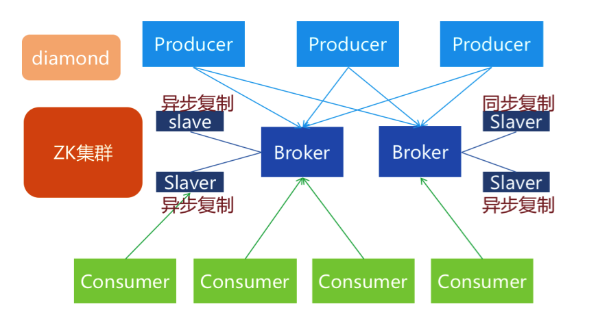
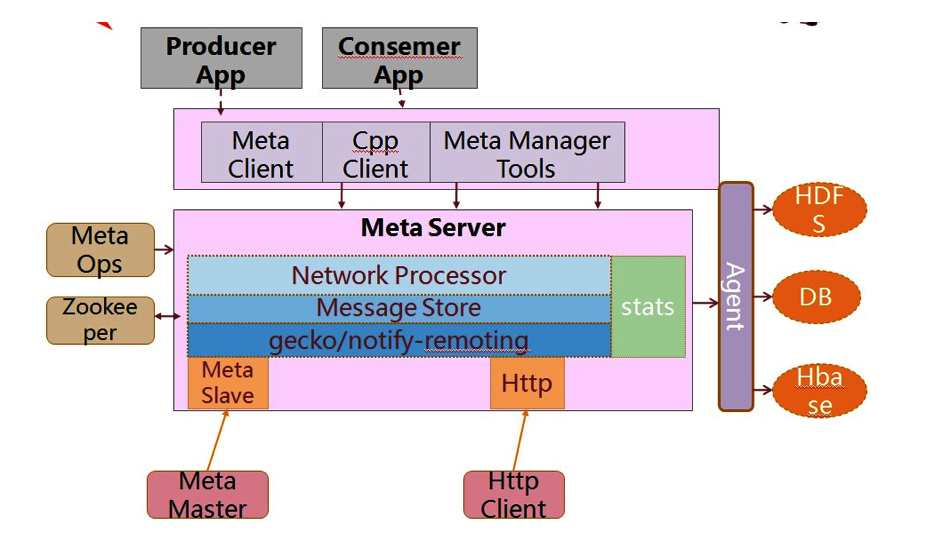

## Metamorphosis介绍
Metamorphosis是一个高性能、高可用、可扩展的分布式消息中间件，思路起源于LinkedIn的Kafka，但并不是Kafka的一个Copy。具有消息存储顺序写、吞吐量大和支持本地和XA事务等特性，适用于大吞吐量、顺序消息、广播和日志数据传输等场景，目前在淘宝和支付宝有着广泛的应用。

###特征
* 生产者、服务器和消费者都可分布
* 消息存储顺序写
* 性能极高,吞吐量大
* 支持消息顺序
* 支持本地和XA事务
* 客户端pull，随机读,利用sendfile系统调用，zero-copy ,批量拉数据
* 支持消费端事务
* 支持消息广播模式
* 支持异步发送消息
* 支持http协议
* 支持消息重试和recover
* 数据迁移、扩容对用户透明
* 消费状态保存在客户端
* 支持同步和异步复制两种HA
* 支持group commit
* 更多……

###总体结构


###内部结构


###Broker增加或减少时
当broker server增加或减少时，client会重新进行负载均衡。Broker减少的瞬间，在负载均衡之前，已经发送到减少的那台broker但未到达服务器时，客户端将会捕获到发送异常，由业务决定如何处理，负载均衡之后将正常发送到其他服务器上。

###客户端使用例子说明

metamorphosis-example里面有详细的使用例子，包括：
* 普通发送消息
* 异步发送消息
* 异步单向发送消息
* 本地事务发送消息
* XA事务发送消息
* Log4j发送，log4j appender配置在main/resources目录下

* 普通消费
* 广播消费
* 批量事务消费
* 同步拉取消费

客户端依赖：
```
<dependency>
    <groupId>com.taobao.metamorphosis</groupId>
    <artifactId>metamorphosis-client</artifactId>
    <version>1.4.0.taocode-SNAPSHOT</version>
</dependency>
<dependency>
    <groupId>com.taobao.metamorphosis</groupId>
    <artifactId>metamorphosis-client-extension</artifactId>
    <version>1.4.0.taocode-SNAPSHOT</version>
</dependency>
```
如果打包有错误请检查是否在自己的maven库发布过客户端了


什么场景下适合使用异步单向和log4j发送
对于发送可靠性要求不那么高,但要求提高发送效率和降低对宿主应用的影响，提高宿主应用的稳定性.
不在乎发送结果成功与否。
从逻辑和耗时上几乎不对业务系统产生影响


##工程结构
* Client,生产者和消费者客户端
* Client-extension，扩展的客户端。用于将消费处理失败的消息存入notify(未提供),和使用meta作为log4j appender，可以透明地使用log4j API发送消息到meta。
* Commons，客户端和服务端一些公用的东西
* Example,客户端使用的例子
* http-client，使用http协议的客户端
* server，服务端工程
* server-wrapper，扩展的服务端，用于将其他插件集成到服务端，提供扩展功能
    1.Meta gergor，用于高可用的同步复制
    2.Meta slave，用于高可用的异步复制
    3.http，提供http协议支持
* Meta spout，用于将meta消息接入到twitter storm集群做实时分析
* Tools，提供服务端管理和操作的一些工具


##配置参数说明

| 配置项 | 说明 | 可选值 |
|-------|------|--------|

##文件删除策略
1、超过一定时间的删除策略
2、消息归档策略


消息put到MQ服务器时，如果事先没有配置topic，则该topic是动态的topic，这时也会注册到zk


消息会话工厂默认使用SimpleMessageConsumer消费者


##会话工厂MessageSessionFactory

作用：

1、获取指定topic下的分区信息

2、创建生产消息的生产者

3、创建消费消息的消费者

4、获取指定MQ服务器上的统计信息


实现类：


* MetaBroadcastMessageSessionFactory

```
广播消息会话工厂,使用这个创建的Consumer在同一分组内的每台机器都能收到同一条消息,推荐一个应用只使用一个MessageSessionFactory
```

* AsyncMessageSessionFactory

```
用于创建异步单向发送消息的会话工厂. 
* 
* 使用场景: 
*      对于发送可靠性要求不那么高,但要求提高发送效率和降低对宿主应用的影响，提高宿主应用的稳定性.
*      例如,收集日志或用户行为信息等场景.
* 注意:
*      发送消息后返回的结果中不包含准确的messageId,partition,offset,这些值都是-1
```

* XAMessageSessionFactory

```
用于创建XA消息会话的工厂
```

* OrderedMessageSessionFactory

```
需要按照消息内容(例如某个id)散列到固定分区并要求有序的场景中使用.
```


# 客户端相关笔记


##客户端配置项说明

```java
/** MetaQ的消费者是以pull模型来从服务端拉取数据并消费，这个参数设置并行拉取的线程数，默认是CPU个数 */
private int fetchRunnerCount = Runtime.getRuntime().availableProcessors();
/** 当上一次没有抓取到的消息，抓取线程sleep的最大时间，默认5秒，单位毫秒，测试的时候可以设置少点，不然会有消费延迟的现象 */
private long maxDelayFetchTimeInMills = 5000;
@Deprecated
private long maxDelayFetchTimeWhenExceptionInMills = 10000;
/** 同步抓取的请求超时，默认10秒，通常不需要修改此参数。 */
private long fetchTimeoutInMills = 10000;
/** 单个消费者的id，必须全局唯一，通常用于标识分组内的单个消费者，可不设置，系统会根据IP和时间戳自动生成*/
private String consumerId;
/** 表示消费端的消费分区，仅在直接连接服务器的时候(即消费指定服务上的消息)有效 */
private String partition;
/** 第一次消费开始位置的offset，默认都是从服务端的最早数据开始消费 */
private long offset = 0;
/** 表示该消费者所在分组，同一分组的消费者正常情况下不会接收重复消息，共同消费某一topic */
private String group;
/**
  * 保存消费者已经消费的数据的offset的间隔时间，默认5秒，单位毫秒。
  * 如果设置为更大的间隔，在故障和重启时间可能重复消费的消息更多；
  * 如果设置为更小的间隔，可能给存储造成压力
  */
private long commitOffsetPeriodInMills = 5000L;
/** 同一条消息在处理失败情况下最大重试消费次数，默认3次，{@link #maxIncreaseFetchDataRetries}超过就跳过这条消息并调用RejectConsumptionHandler处理 */
private int maxFetchRetries = 3;
/** 设置每次订阅是否从最新位置开始消费,如果为true，表示每次启动都从最新位置开始消费,通常在测试的时候可以设置为true。*/
private boolean alwaysConsumeFromMaxOffset = false;
/** 消费端的负载均衡策略，这里使用默认的负载均衡策略，尽量使得负载在所有consumer之间平均分配，consumer之间分配的分区数差距不大于1 */
private LoadBalanceStrategy.Type loadBalanceStrategyType = LoadBalanceStrategy.Type.DEFAULT;
/** 把消息处理失败重试跟拉取数据失败重试分开,因为有时不需要处理失败重试(maxFetchRetries设为maxIntValue),但需要自增长拉取的数据量 */
private int maxIncreaseFetchDataRetries = 5;
```

